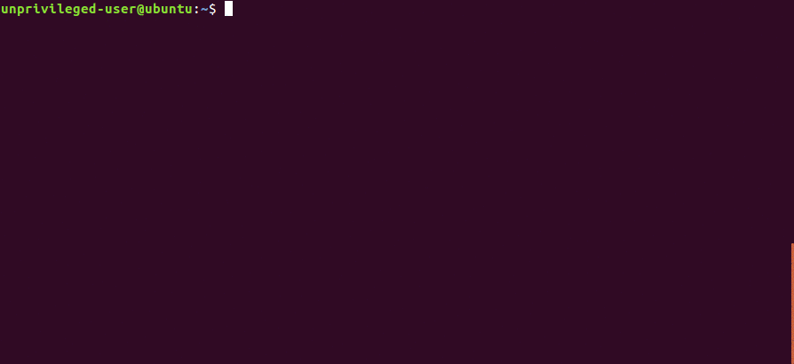

# Paranoid

Paranoid is a [limited](#limitations) but fully rootless containeriztion tool. It allows unprivelged users on a system to create light-weight containers in which they can act as `root`.

It definately shouldn't be used for anything serious. That said, since it doesn't require any elevated privileges, the risk of escape is only as great as the user's rights outside of the container.

## Usage

`paranoid` requires at least three arguments. The hostname of the new container, the path of the new rootfs, and the path to the init process **relative to the new rootfs**. Any additional arguments will be passed on to PID 1.

  1. Extract [a rootfs tarball](https://us.images.linuxcontainers.org/images) somewhere on your system (ignore any permission errors related to `chown` or `mknod`).
  2. Run `paranoid container-hostname ./path-to-extracted-root-fs /bin/bash -l`.
  3. Profit!

## Limitations

  * Only a single uid and gid are mapped into the container's user namespace, so you can only login as root. This can cause a few strange issues, but things mostly work.
  * The networking is not currently isolated.

## Todo

  * Map a range of uid's and gid's into the user namespace so that tools actually work correctly. **not possible?** **maybe some ptrace hackary?**
  * Isolate the networking (translate raw packet data from TUN fd into sockets in userspace). **started (see tun2socks)**
  * Cgroups and resource limits
  * Rewrite in Rust

## Development

This project uses [cmake](https://cmake.org/cmake-tutorial/). You can probably get it building by running `cmake CMakeLists.txt` to generate the `Makefile`, then `make`. You'll need the development headers for `libcap` installed.

## Contributing

Bug reports and pull requests are welcome on [GitHub](https://github.com/anarchocurious/paranoid).

## License

This library is available as open source under the terms of the [MIT License](http://opensource.org/licenses/MIT).
